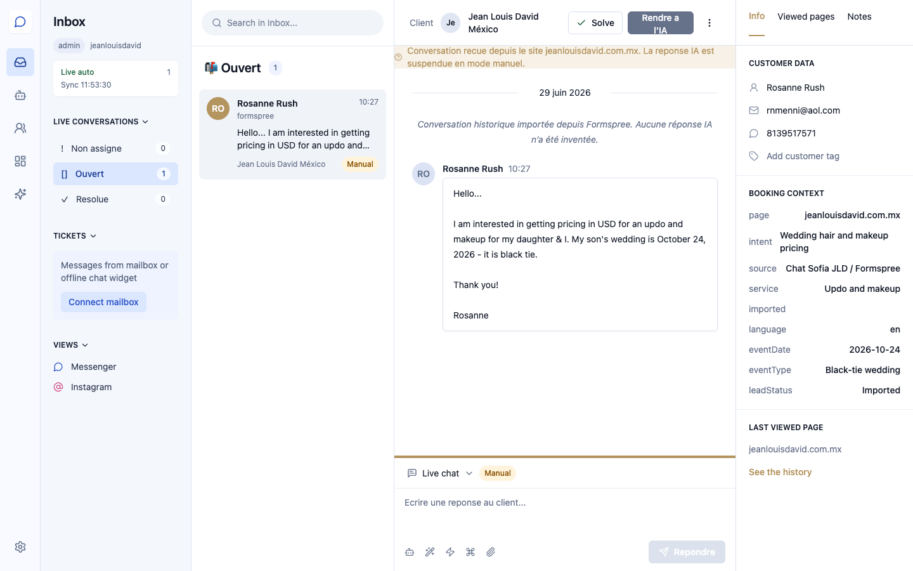
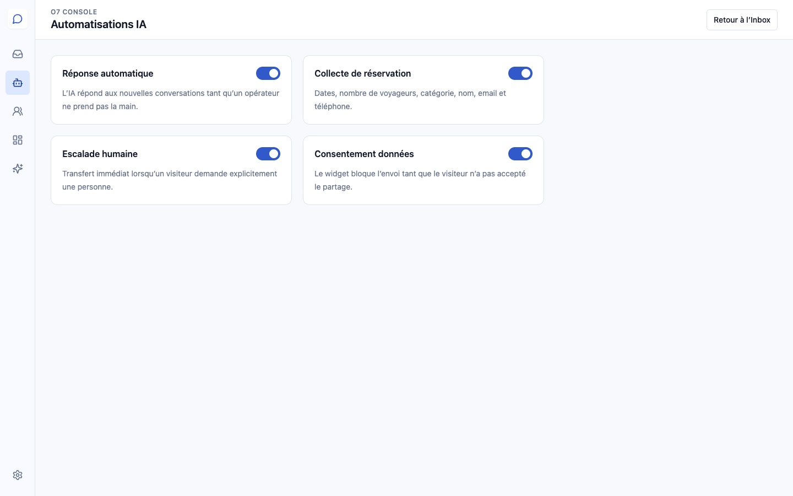
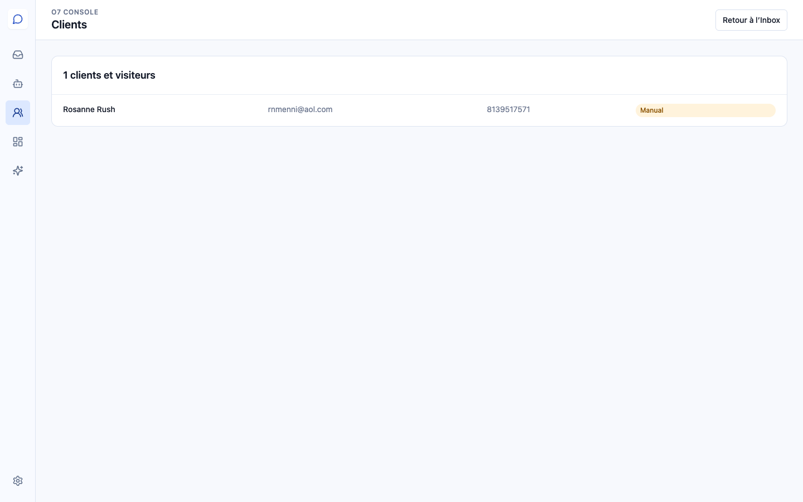
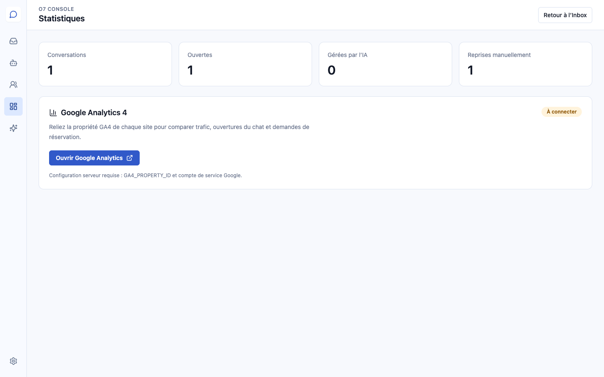
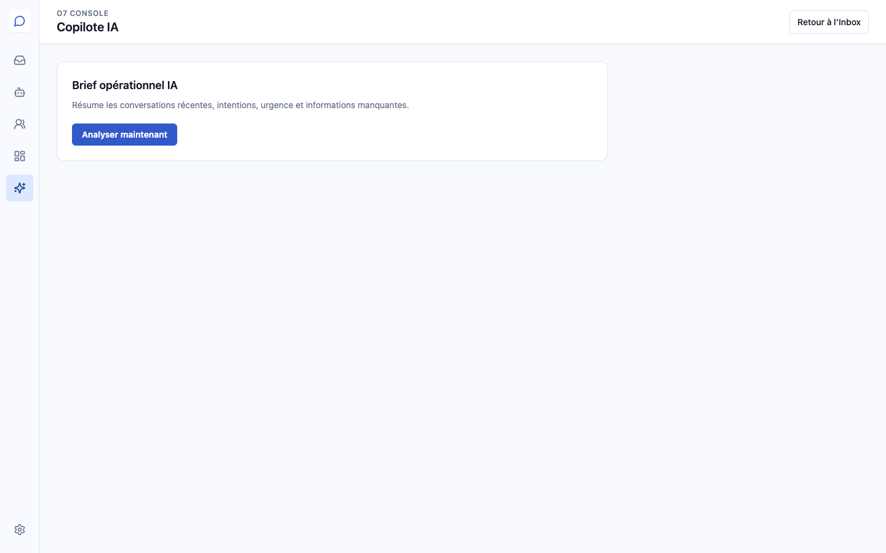

# Guía de usuario — Olivia AI Channel Manager

Jean Louis David México · 30 de junio de 2026

Acceso: [Olivia AI Channel Manager](https://suitesmine-e3g2m7175-olivier-steineur.vercel.app/inbox?client=jeanlouisdavid)

## 1. Bandeja de entrada

Este espacio muestra únicamente las conversaciones asociadas con Jean Louis David México.

- Seleccione una conversación en la columna central.
- **Prendre la main** permite responder manualmente y pausa la IA.
- **Rendre à l’IA** devuelve la conversación a Olivia AI.
- **Solve** cierra una solicitud terminada.
- El panel derecho muestra los datos y el contexto de la solicitud.

La conversación histórica visible fue importada desde Formspree y está identificada como importación. No se inventó ninguna respuesta de Olivia AI.

## 2. Automatizaciones

El sistema reúne las respuestas automáticas, la recopilación de datos, la transferencia a una persona y el consentimiento para compartir información.

## 3. Clientes

La sección **Clients** permite encontrar visitantes, datos de contacto y estado de atención.

## 4. Estadísticas

Muestra conversaciones totales, abiertas, atendidas por IA y retomadas manualmente. Google Analytics 4 podrá relacionar tráfico, aperturas del chat y solicitudes.

## 5. Copiloto IA

El Copiloto genera un resumen operativo de conversaciones recientes, necesidades, urgencia e información pendiente.

## 6. Configuración y seguridad

Esta pantalla muestra el estado de integraciones. Desde el perfil seguro se gestionan correo, sesiones y autenticación de dos factores.

## Flujo recomendado

1. Revise las conversaciones abiertas.
2. Use **Prendre la main** cuando sea necesaria una respuesta personal.
3. Contacte al visitante mediante los datos proporcionados.
4. Añada notas internas cuando sea necesario.
5. Cierre la solicitud con **Solve**.
6. Active el 2FA desde el primer acceso.

## Privacidad

El acceso requiere una cuenta autorizada. No comparta capturas con datos personales fuera del equipo responsable. Los datos importados desde Formspree conservan su origen para asegurar trazabilidad.
