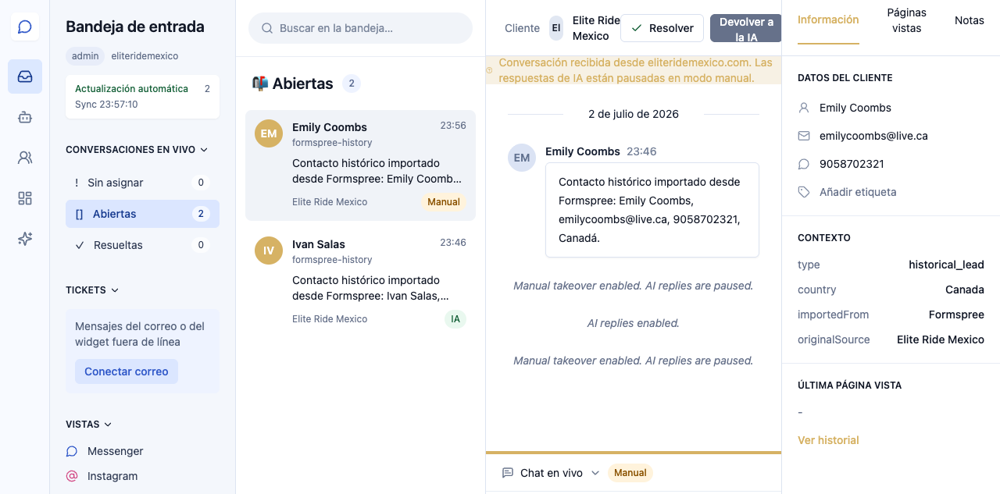
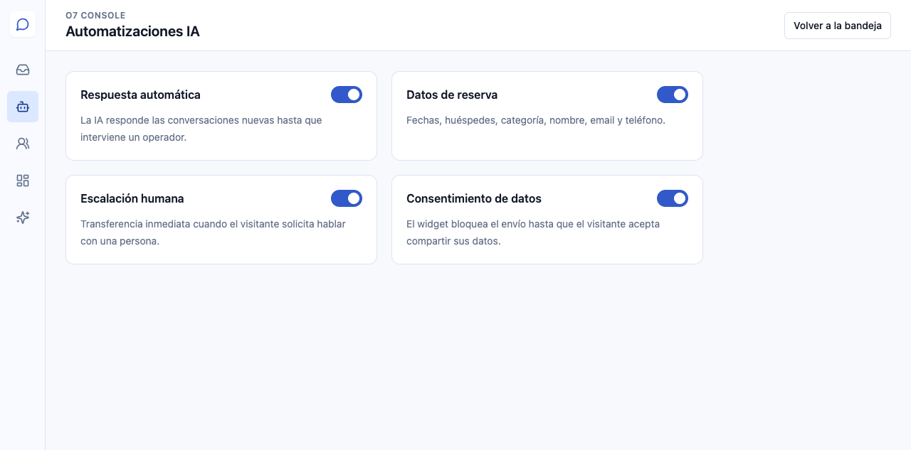
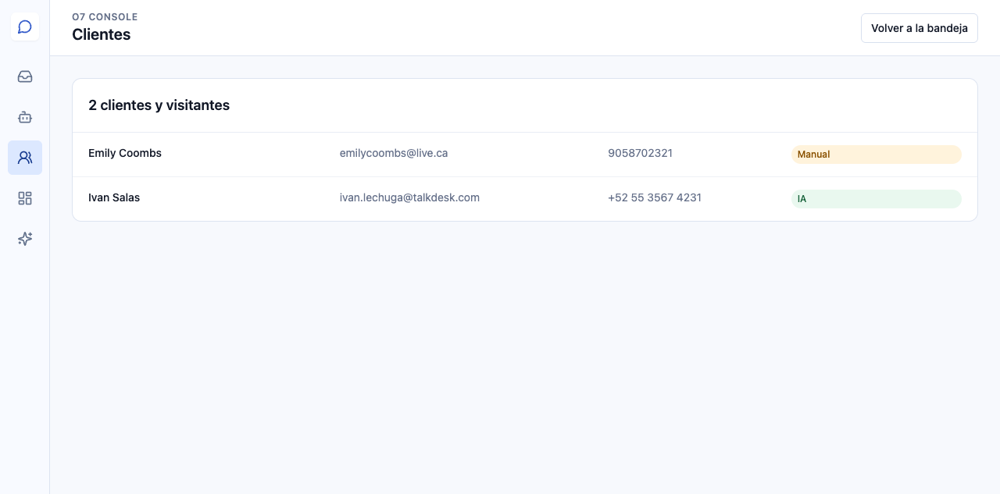
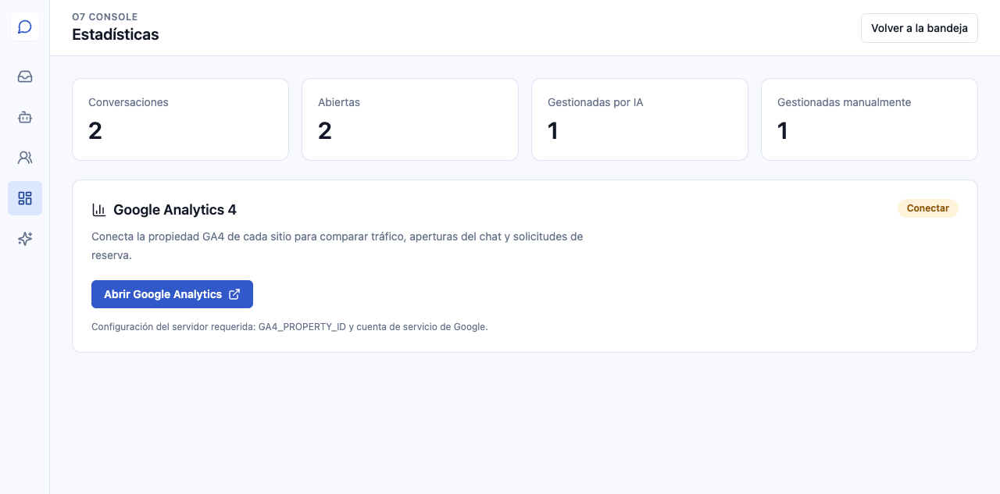
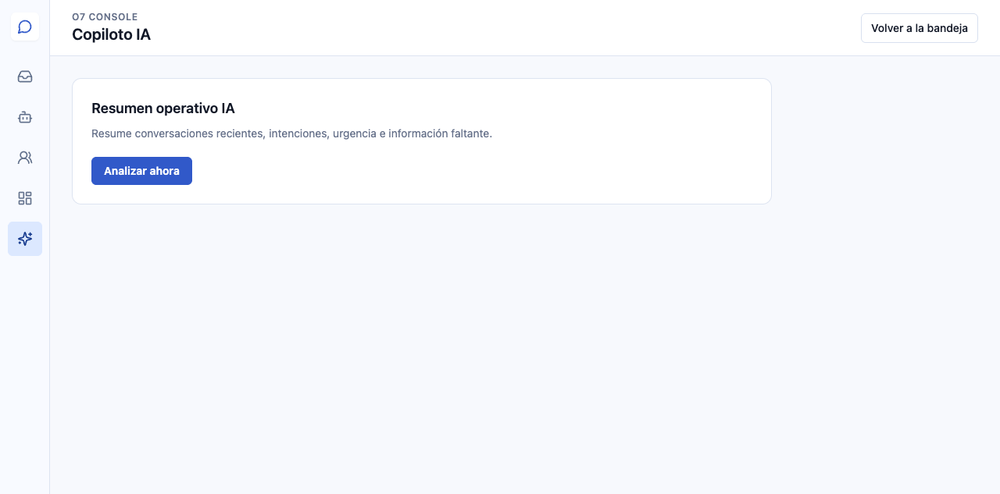

# Guía de usuario — Olivia AI Channel Manager

## Acceso

Abra `https://olivia-ai.o7digital.com/sign-in` e inicie sesión con la cuenta autorizada de su empresa. Clerk protege el acceso y muestra únicamente la piel y los datos asignados a cada cliente.

## 1. Bandeja de entrada

La Bandeja reúne las conversaciones del widget web y, cuando estén conectados, WhatsApp Business, Facebook Messenger, Instagram Direct y correo electrónico.

- **Sin asignar**: conversaciones pendientes de operador.
- **Abiertas**: conversaciones atendidas por Olivia AI o por una persona.
- **Resueltas**: conversaciones finalizadas.
- **Tomar control**: pausa la respuesta automática de Olivia.
- **Devolver a la IA**: reactiva la atención automática.
- **Resolver**: cierra la conversación.

El selector **FR / EN / ES** cambia el idioma de toda la interfaz y recuerda la elección en el navegador. El contenido escrito por el visitante permanece en su idioma original.

## 2. Responder y usar las herramientas

Para responder manualmente:

1. Seleccione una conversación.
2. Pulse **Tomar control**.
3. Escriba la respuesta.
4. Pulse **Responder**.

Los botones situados debajo del mensaje permiten:

- solicitar una sugerencia de respuesta a la IA;
- insertar un saludo;
- insertar una respuesta rápida;
- colocar el cursor en el campo;
- seleccionar un archivo y añadir su referencia al mensaje.

## 3. Automatizaciones

Esta sección muestra las funciones activas por defecto: respuesta automática, recopilación de datos, escalación humana y consentimiento para el tratamiento de datos.

## 4. Clientes y visitantes

La sección **Clientes** centraliza nombre, email, teléfono y estado de cada contacto. Los datos se mantienen separados por piel o `clientCode`.

## 5. Estadísticas

Muestra conversaciones totales, abiertas, gestionadas por IA y gestionadas manualmente. Google Analytics 4 puede conectarse para relacionar tráfico, aperturas del chat y conversiones.

## 6. Copiloto IA

El Copiloto resume conversaciones recientes, identifica intención, sentimiento y urgencia, detecta información faltante y propone una respuesta.

## 7. Configuración, seguridad y canales

Desde **Configuración y seguridad** puede abrir el perfil Clerk, gestionar sesiones y activar la autenticación de dos factores.

Cada nueva piel incluye por defecto:

- widget web;
- WhatsApp Business;
- Facebook Messenger;
- Instagram Direct;
- correo electrónico;
- Google Analytics;
- OpenAI y demás integraciones aplicables.

Un canal marcado **Por configurar** todavía necesita las credenciales y la autorización de la cuenta correspondiente. Las contraseñas y tokens nunca deben enviarse por chat ni guardarse en el navegador.

## Soporte

Channel Manager: `https://olivia-ai.o7digital.com/inbox`

La dirección puede incluir `?client=código-del-cliente` para abrir directamente la piel autorizada.
