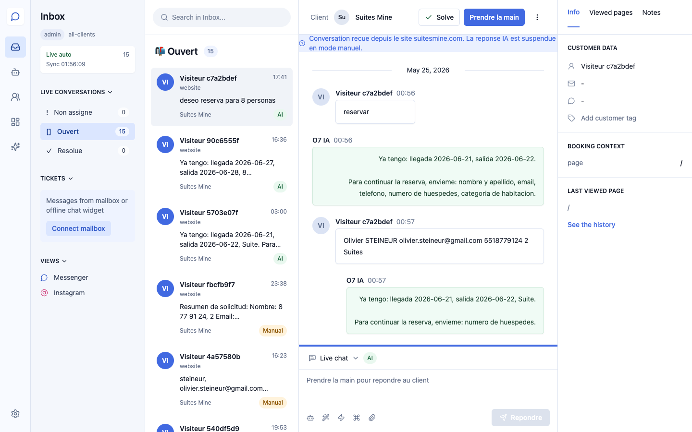
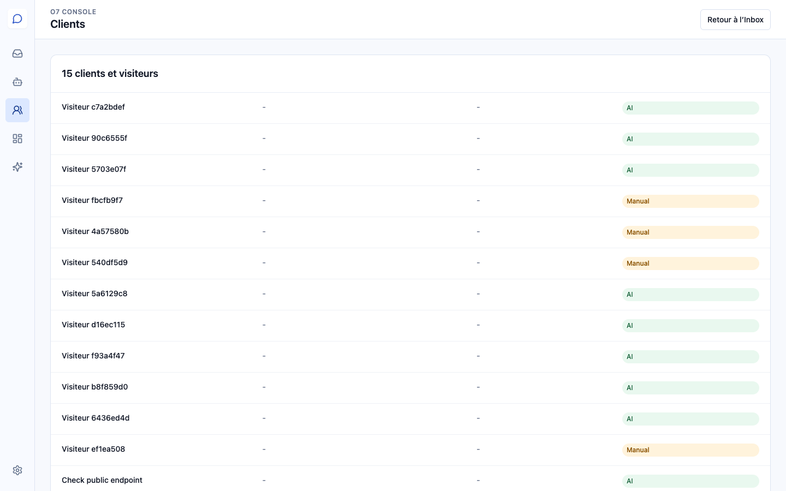
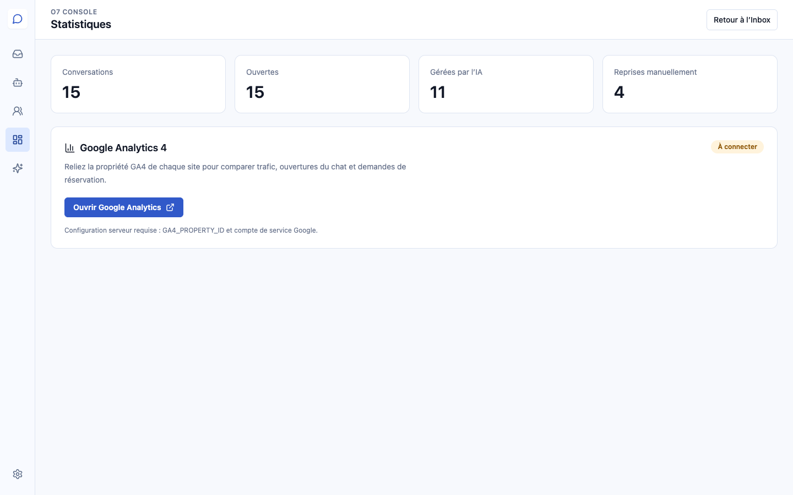
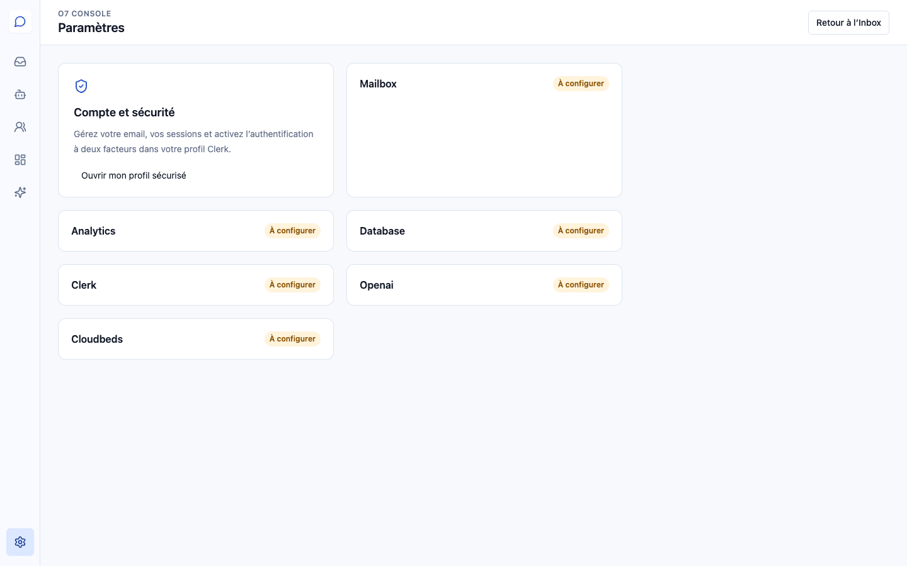
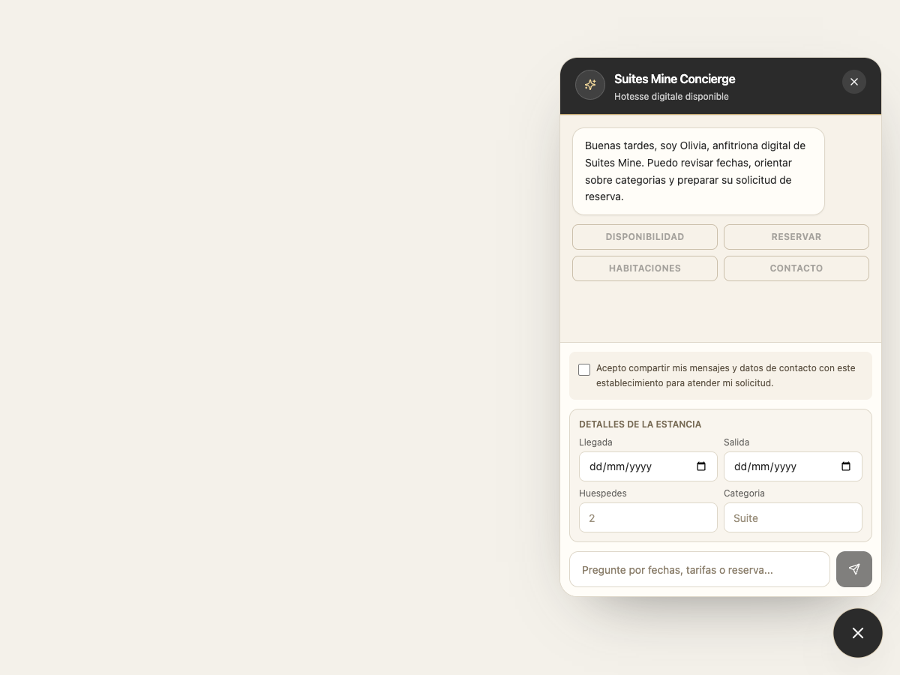

# Guide utilisateur — O7 Console

Version client · 30 juin 2026

O7 Console centralise les conversations provenant du site, les reprises manuelles, le suivi des visiteurs, les statistiques et les intégrations. Chaque client dispose de son propre espace et ne voit que les données associées à son site.

## 1. Boîte de réception

- Sélectionnez une conversation dans la colonne centrale.
- **Prendre la main** suspend l’IA et permet à un opérateur de répondre.
- **Rendre à l’IA** réactive les réponses automatiques.
- **Solve** clôture une conversation terminée.
- Le panneau de droite affiche les coordonnées, le contexte de réservation et la dernière page visitée.

Les états sont visibles directement dans la liste :

- **AI** : conversation gérée automatiquement ;
- **Manual** : un opérateur a pris la main ;
- **Solved** : conversation clôturée.

## 2. Automatisations IA

Cet écran présente les automatisations actives :

- réponse automatique aux nouvelles conversations ;
- collecte des informations nécessaires à une réservation ;
- escalade vers un opérateur lorsqu’un visiteur demande une personne ;
- consentement obligatoire avant l’envoi de données.

## 3. Clients et visiteurs

La vue **Clients** rassemble les visiteurs connus avec leur email, téléphone et état de conversation. Elle permet de retrouver rapidement une demande sans parcourir toute l’Inbox.

## 4. Statistiques et Google Analytics

Le tableau de bord affiche :

- le nombre total de conversations ;
- les conversations ouvertes ;
- les conversations traitées par l’IA ;
- les reprises manuelles.

La section Google Analytics 4 permet de relier la propriété GA4 du site afin de comparer le trafic, les ouvertures du chat et les demandes de réservation.

## 5. Copilote IA

Le **Copilote IA** analyse les conversations récentes et prépare un brief opérationnel : résumé, intentions, sentiment, urgence, informations manquantes et suggestion de réponse.

Cliquez sur **Analyser maintenant** pour lancer une nouvelle analyse.

## 6. Paramètres, intégrations et sécurité

La page **Paramètres et sécurité** indique l’état des services connectés :

- boîte email ;
- Google Analytics ;
- base de données ;
- authentification Clerk ;
- OpenAI ;
- Cloudbeds.

Le profil sécurisé permet de gérer l’adresse email, les sessions ouvertes et l’authentification à deux facteurs (2FA). Nous recommandons d’activer le 2FA dès la première connexion.

## 7. Consentement du visiteur

Avant son premier message, le visiteur doit accepter le partage de ses messages et coordonnées avec l’établissement. Tant que la case n’est pas cochée, les actions et le bouton d’envoi restent désactivés.

Le consentement s’applique à toutes les langues et à toutes les identités graphiques du widget.

## Bonnes pratiques

1. Activez le 2FA dès la création du compte.
2. Laissez l’IA répondre aux demandes courantes.
3. Utilisez **Prendre la main** pour les cas sensibles ou particuliers.
4. Clôturez les demandes terminées avec **Solve**.
5. Consultez régulièrement les statistiques et le Copilote IA.

## Assistance

Pour toute demande de configuration, d’accès ou d’intégration, contactez l’administrateur de votre espace O7 Console.
